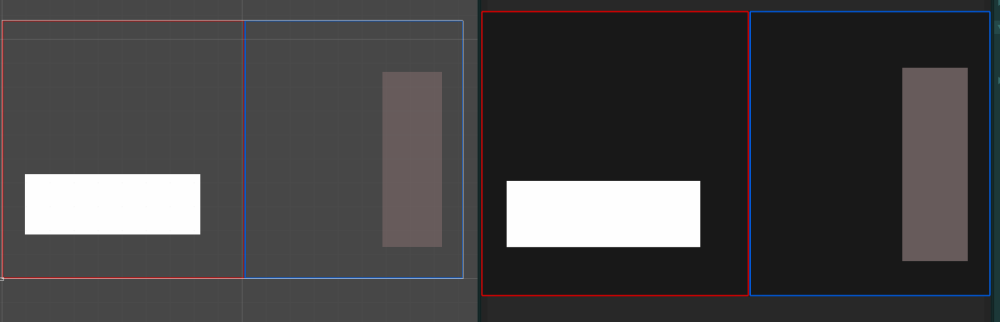
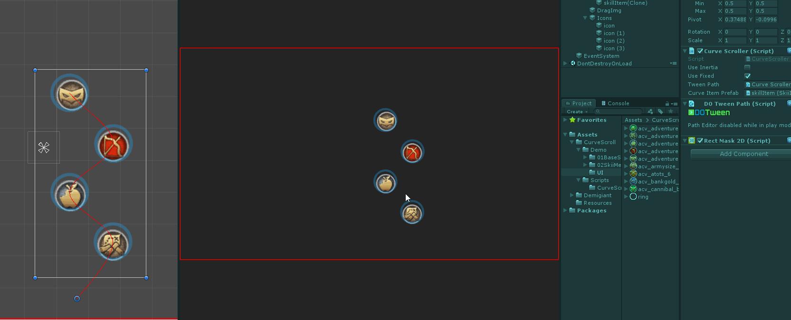
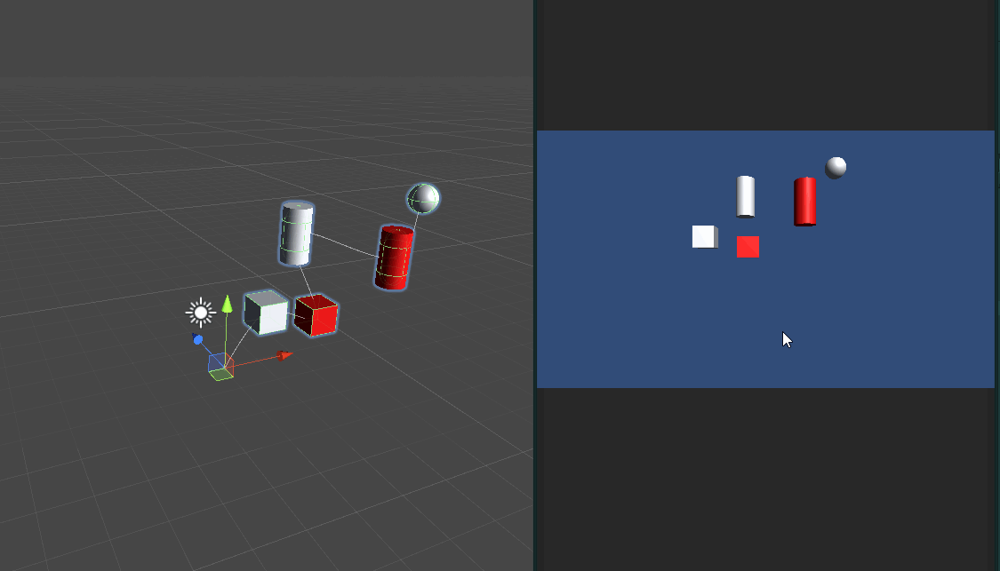
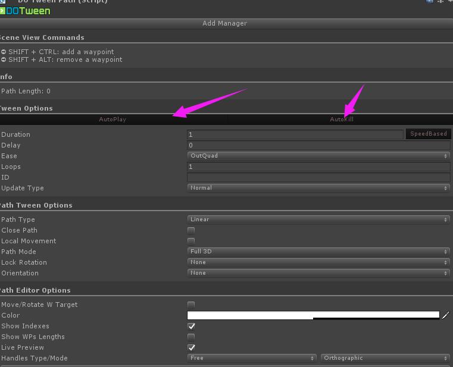
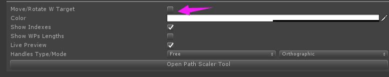

# CurveScroller
自定义曲线滑动

**需要注意的地方**:

1. 使用了dotween pro 插件 ,使用的时候必须要导入该插件 :https://assetstore.unity.com/packages/tools/visual-scripting/dotween-pro-32416 

2. dotween path 设置

   1. 

      

   2. 如果在用于UGUI请把 `Move/Rotate W Target`或者 `relatively` 去掉勾选

      

